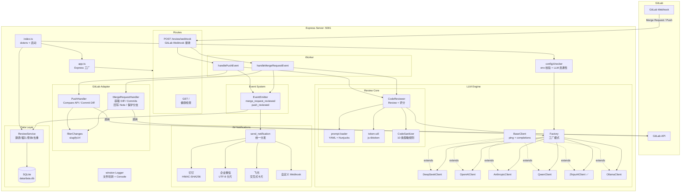
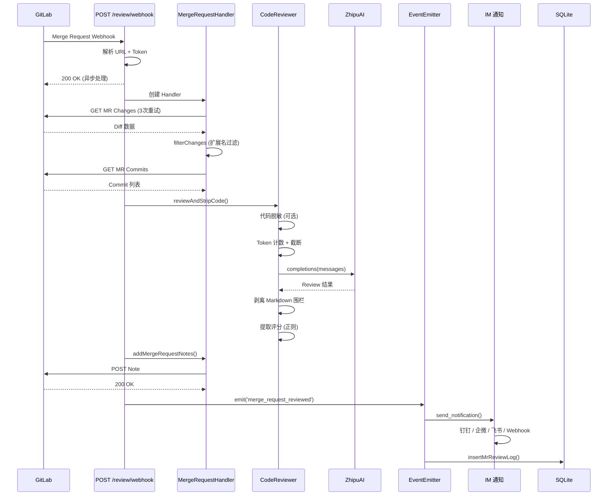
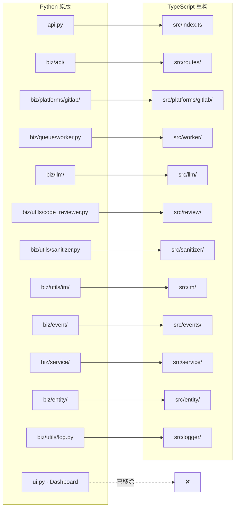

# ai-codereview-ts 架构图

## 系统架构总览

```mermaid
graph TB
    subgraph GitLab
        GL[GitLab Webhook]
        GL_API[GitLab API]
    end

    subgraph Express Server :5001
        ENTRY[index.ts<br/>dotenv + 启动]
        APP[app.ts<br/>Express 工厂]

        subgraph Routes
            HEALTH[GET /<br/>健康检查]
            WEBHOOK[POST /review/webhook<br/>GitLab Webhook 接收]
        end

        subgraph Worker
            MR_HANDLER[handleMergeRequestEvent]
            PUSH_HANDLER[handlePushEvent]
        end

        subgraph GitLab Adapter
            MR_H[MergeRequestHandler<br/>获取 Diff / Commits<br/>回写 Note / 保护分支]
            PUSH_H[PushHandler<br/>Compare API / Commit Diff]
            UTILS[filterChanges<br/>slugifyUrl]
        end

        subgraph LLM Engine
            FACTORY[Factory<br/>工厂模式]
            BASE[BaseClient<br/>ping + completions]
            DS[DeepSeekClient]
            OA[OpenAIClient]
            AT[AnthropicClient]
            QW[QwenClient]
            ZP[ZhipuAIClient ✅]
            OL[OllamaClient]

            subgraph Review Core
                REVIEWER[CodeReviewer<br/>Review + 评分]
                PROMPT[prompt-loader<br/>YAML + Nunjucks]
                TOKEN[token-util<br/>js-tiktoken]
                SANITIZER[CodeSanitizer<br/>10 条脱敏规则]
            end
        end

        subgraph Event System
            EM[EventEmitter<br/>merge_request_reviewed<br/>push_reviewed]
        end

        subgraph IM Notifications
            NOTIFIER[send_notification<br/>统一分发]
            DT[钉钉<br/>HMAC-SHA256]
            WC[企业微信<br/>UTF-8 分片]
            FS[飞书<br/>交互式卡片]
            WH[自定义 Webhook]
        end

        subgraph Data Layer
            DB[(SQLite<br/>data/data.db)]
            SVC[ReviewService<br/>建表/插入/查询/去重]
        end

        LOG[winston Logger<br/>文件轮转 + Console]
        CONF[config/checker<br/>env 校验 + LLM 连通性]
    end

    GL -->|Merge Request / Push| WEBHOOK
    WEBHOOK --> MR_HANDLER
    WEBHOOK --> PUSH_HANDLER

    MR_HANDLER --> MR_H
    PUSH_HANDLER --> PUSH_H
    MR_H --> UTILS
    PUSH_H --> UTILS

    MR_HANDLER --> REVIEWER
    PUSH_HANDLER --> REVIEWER
    REVIEWER --> SANITIZER
    REVIEWER --> PROMPT
    REVIEWER --> TOKEN
    REVIEWER --> FACTORY

    FACTORY --> DS & OA & AT & QW & ZP & OL
    BASE -.->|extends| DS & OA & AT & QW & ZP & OL

    MR_HANDLER --> EM
    PUSH_HANDLER --> EM

    EM --> NOTIFIER
    NOTIFIER --> DT & WC & FS & WH

    EM --> SVC
    SVC --> DB

    MR_H -->|调用| GL_API
    PUSH_H -->|调用| GL_API

    ENTRY --> APP --> Routes
    ENTRY --> CONF --> FACTORY
    ENTRY --> SVC
```

## 核心数据流

```mermaid
sequenceDiagram
    participant GL as GitLab
    participant WH as POST /review/webhook
    participant MR as MergeRequestHandler
    participant REV as CodeReviewer
    participant LLM as ZhipuAI
    participant EVT as EventEmitter
    participant IM as IM 通知
    participant DB as SQLite

    GL->>WH: Merge Request Webhook
    WH->>WH: 解析 URL + Token
    WH-->>GL: 200 OK (异步处理)

    WH->>MR: 创建 Handler
    MR->>GL: GET MR Changes (3次重试)
    GL-->>MR: Diff 数据
    MR->>MR: filterChanges (扩展名过滤)
    MR->>GL: GET MR Commits
    GL-->>MR: Commit 列表

    WH->>REV: reviewAndStripCode()
    REV->>REV: 代码脱敏 (可选)
    REV->>REV: Token 计数 + 截断
    REV->>LLM: completions(messages)
    LLM-->>REV: Review 结果
    REV->>REV: 剥离 Markdown 围栏
    REV->>REV: 提取评分 (正则)

    WH->>MR: addMergeRequestNotes()
    MR->>GL: POST Note
    GL-->>MR: 200 OK

    WH->>EVT: emit('merge_request_reviewed')
    EVT->>IM: send_notification()
    IM->>IM: 钉钉 / 企微 / 飞书 / Webhook
    EVT->>DB: insertMrReviewLog()
```

## 目录结构映射

```mermaid
graph LR
    subgraph Python 原版
        api_py[api.py]
        biz_api[biz/api/]
        biz_plat[biz/platforms/gitlab/]
        biz_queue[biz/queue/worker.py]
        biz_llm[biz/llm/]
        biz_review[biz/utils/code_reviewer.py]
        biz_san[biz/utils/sanitizer.py]
        biz_im[biz/utils/im/]
        biz_evt[biz/event/]
        biz_svc[biz/service/]
        biz_ent[biz/entity/]
        biz_log[biz/utils/log.py]
        ui_py[ui.py - Dashboard]
    end

    subgraph TypeScript 重构
        idx[src/index.ts]
        routes[src/routes/]
        platform[src/platforms/gitlab/]
        worker[src/worker/]
        llm[src/llm/]
        review[src/review/]
        sanitizer[src/sanitizer/]
        im[src/im/]
        events[src/events/]
        service[src/service/]
        entity[src/entity/]
        logger[src/logger/]
    end

    api_py --> idx
    biz_api --> routes
    biz_plat --> platform
    biz_queue --> worker
    biz_llm --> llm
    biz_review --> review
    biz_san --> sanitizer
    biz_im --> im
    biz_evt --> events
    biz_svc --> service
    biz_ent --> entity
    biz_log --> logger
    ui_py -.->|已移除| x[❌]
```
