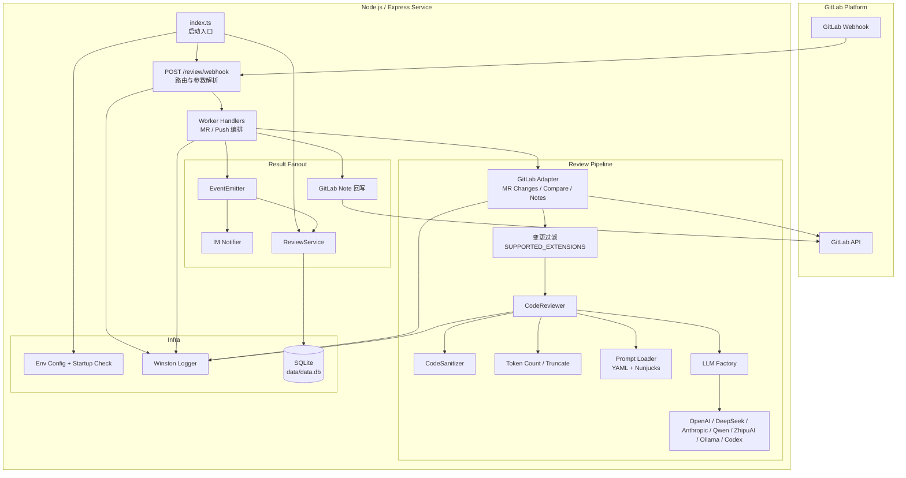
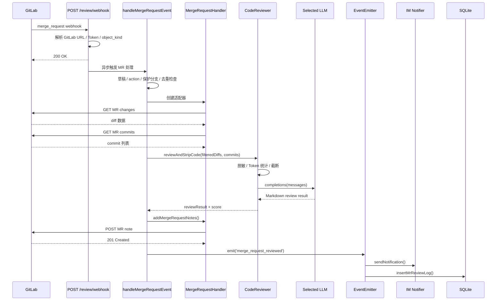
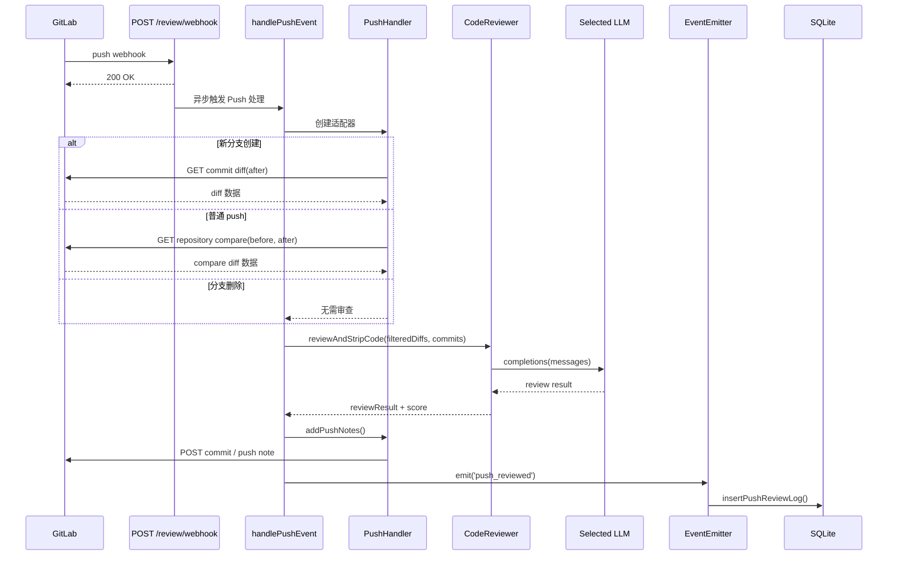

# ai-codereview-ts 架构图

## 系统架构总览

## Merge Request 审查流程

## Push 审查流程

## 设计要点

- Webhook 接口快速返回，实际审查在后台异步执行，降低 GitLab 超时风险。
- `worker` 只负责流程编排，GitLab API、LLM、通知、存储都被拆到独立模块，便于替换和测试。
- Prompt、模型 Provider、文件过滤规则都在配置层可切换，不需要改主流程。
- 审查结果同时进入三条出口：GitLab Note、IM 通知、SQLite 日志，便于协作和追踪。
